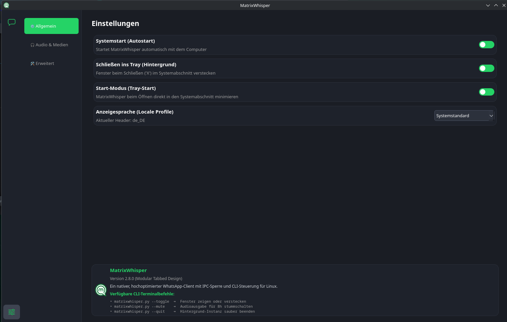
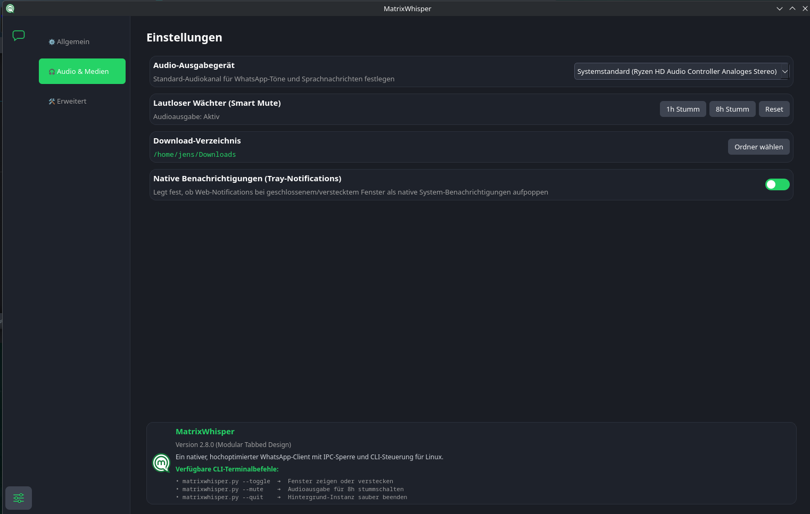
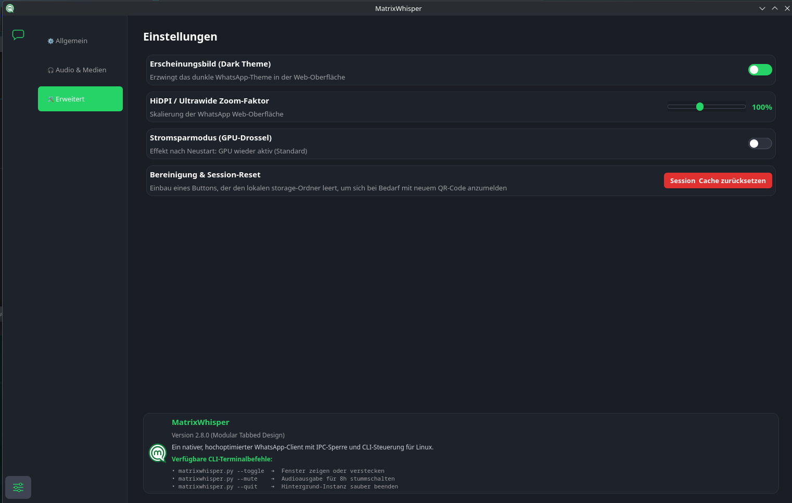

<p align="center">
  
</p>

<h1 align="center">MatrixWhisper</h1>

<p align="center">
  <strong>Ein nativer WhatsApp-Client für Linux – leichtgewichtig, schnell und voller Funktionen.</strong>
</p>

<p align="center">
  
  
  
</p>

<p align="center">
  
</p>

<p align="center">
  
</p>

<p align="center">
  
</p>

MatrixWhisper ist ein maßgeschneiderter, nativer WhatsApp-Client für Linux-Desktops, basierend auf **PyQt6** und **QtWebEngine**. Im Gegensatz zu offiziellen Desktop-Apps oder generischen Wrappern verzichtet MatrixWhisper komplett auf das ressourcenfressende Electron-Framework und setzt stattdessen auf eine schlanke, native Qt6-Architektur.

> **Wichtiger Hinweis:** Diese App wird unabhängig verteilt, weil die Flathub-Admins das Projekt fälschlicherweise blockiert haben. Wir unterstützen die Community weiterhin direkt über GitHub. Flatpak hat die Software ohne Prüfung nicht akzeptiert.

---

## Features

- **Erweitertes Audio-Routing** – Wähle ein spezifisches Audiogerät für WhatsApp-Töne und Sprachnachrichten aus.
- **System-Tray Integration** – Schließen des Fensters minimiert die App elegant in den Systemabschnitt.
- **Smart Mute** – Schalte die Audioausgabe temporär stumm (1h / 8h / Reset).
- **Stromsparmodus (GPU-Drossel)** – Deaktiviere die Hardware-Beschleunigung der WebEngine.
- **HiDPI & Ultrawide Zoom** – Stufenlose Skalierung (80 % – 130 %).
- **Erzwungenes Dark Theme** – Injiziert das dunkle WhatsApp-Design direkt beim Laden der Seite.
- **Session-Reset & Cache-Bereinigung** – Ein Klick löscht alle lokalen Daten.
- **Single-Instance-Architektur** – Nur eine Instanz der App kann gleichzeitig laufen.
- **Native Benachrichtigungen** – Web-Notifications bei geschlossenem Fenster als native System-Benachrichtigungen anzeigen.
- **Download-Verzeichnis** – Lege einen dedizierten Ordner für WhatsApp-Downloads fest.
- **Start-Modus (Tray-Start)** – MatrixWhisper beim Öffnen direkt in den Systemabschnitt minimieren.
- **Lokalisierung** – Vollständig übersetzte UI in 8 Sprachen (DE, EN, ES, FR, IT, NL, PT, PL).

---

## Installation

### Voraussetzungen

Stelle sicher, dass Python 3 und die benötigten Qt6‑Bibliotheken auf deinem Linux‑System installiert sind.

**Fedora / RedHat:**
```bash
sudo dnf install python3-pyqt6 python3-pyqt6-webengine
```

**Arch Linux / CachyOS / Manjaro:**
```bash
sudo pacman -S python-pyqt6 python-pyqt6-webengine
```

### Schnellstart

1. Repository klonen:
   ```bash
   git clone https://github.com/sonictriplex/MatrixWhisper.git
   cd MatrixWhisper
   ```

2. Flatpak-Build ausführen:
   ```bash
   flatpak-builder --user --install --force-clean build-dir org.media_matrix.MatrixWhisper.yml
   ```

3. App starten:
   ```bash
   flatpak run org.media_matrix.MatrixWhisper
   ```

Alternativ kann die App auch direkt mit Python gestartet werden:
```bash
python3 matrixwhisper.py
```

---

## CLI-Controller

Die App kann über die Kommandozeile gesteuert werden, ohne eine zweite Instanz zu starten:

```bash
# Fenster ein-/ausblenden
python3 matrixwhisper.py --toggle

# Audio für 8 Stunden stummschalten
python3 matrixwhisper.py --mute

# App beenden
python3 matrixwhisper.py --quit

# Fenster anzeigen (falls minimiert)
python3 matrixwhisper.py --show
```

---

## Lizenz

Dieses Projekt ist unter der **GPL-3.0** lizenziert – siehe die Datei `LICENSE` für Details.

---

Entwickelt mit ❤️ von **sonictriplex**
